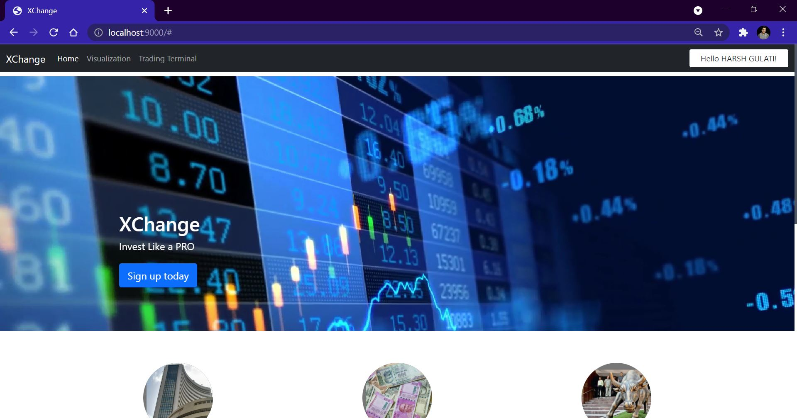
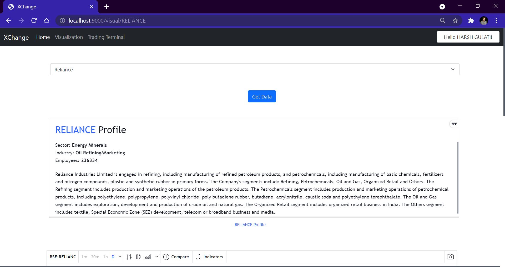
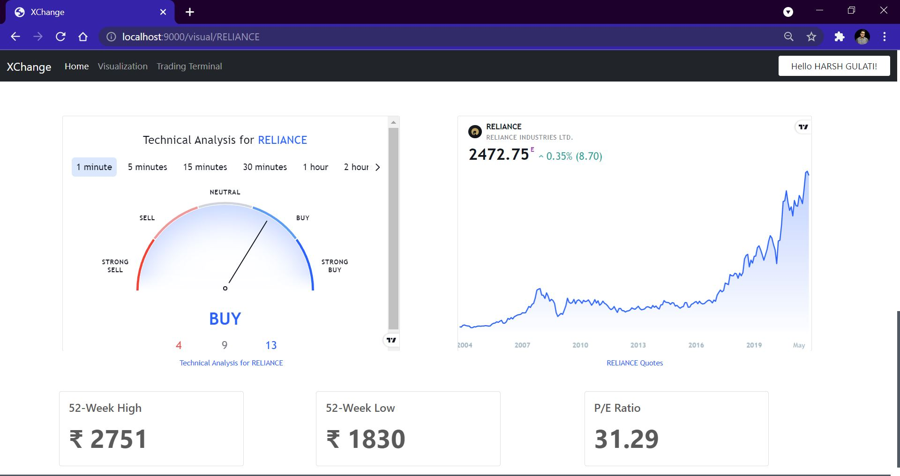
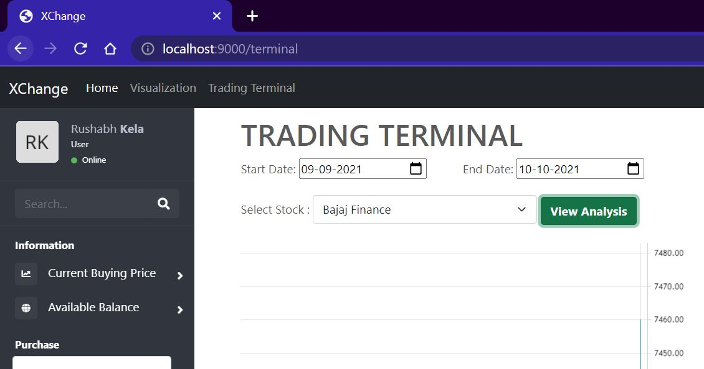
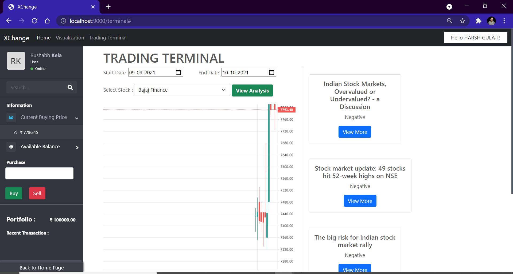
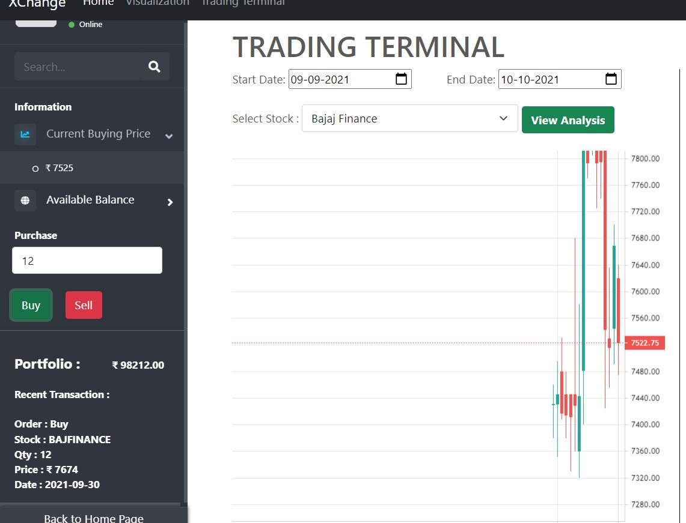

# XChange
With the increase in the count of new Retails Investors in Stock Market there was also a problem that rises suddenly, that is lack of guidance and experience. 
People start beleiving easily on Tips and Tricks and made short term profits, but today markets are at all time high. 
What Now and How ??

XChange is a One Stop Solution for a Individual to plan and succeed his Financial Journey.

XChange is a stock market terminal with all the features one needs to ace his journey of stock trading. It has a virtual trading terminal, a visualisation dashboard, historical pattern analysis.

This will give the user an insight of the stock market fundamentals, risks and benefits associated with it.




## **Users Can easily visualize the data here and can read and do fundamental analysis of any company**






## Here we have our main product **Trading Terminal** where we provide users the access to fetch the historical data with selected date range and analyze the news and the technical chart on the same dashboard of the Terminal.




## **User can select the Stock and Also do investment with respect to the selected date range itself**






# TECH STACK USED :
1. HTML
2. CSS
3. Bootstrap
4. JavaScript
5. NodeJS
6. MongoDB
7. Express Framework


### Clone the repository
```
cd XChange
```
## Run the Project
### Step 1: Create the following .env file in root directory 
```sh
 GOOGLE_CLIENT_ID = 
 GOOGLE_CLIENT_SECRET = 
 MONGODB_URI = 
 SESSION_KEY = xchange
``` 
### Step 2: npm install
### Step 3: npm start
# Open http://localhost:9000 on your browser
```sh
